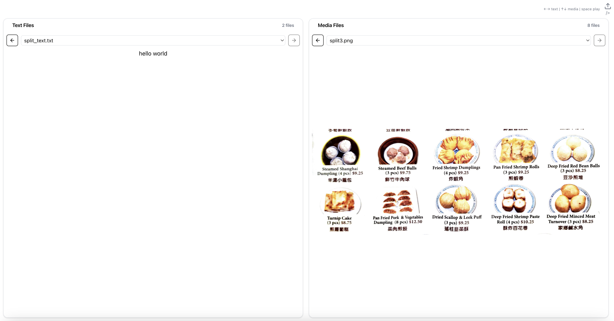

# useful_react


interestingly how I can I use a Notion simulator, that will enable me to scroll .txt files?


media-reader1.tsx, this can load image and text, and will separate the two. First dropdown (text files) can be controlled by the right arrow.  Loading files can be doing using shift and then click down to open multiple files.


and the bottom image scrollbar can be scrolled by the left arrow


Media-reader-2.txt have them side by side panels


media-reader-3.tsx

here is the the main code for loading media files along with images.  I think this will be great in looking at notes and looking at images side by side. 

right and left arrows toggle the text files, and up and down arrows toggle the image/media files.


clicking on the top right is to get the prompt to load the files




-prompted using Claude (AI)


can download the folder loading_mp4_files:  to run, use npm install to install dependencies, then npm start.


Updated:

two folders,

**02-loading_mp4_files_working_folder_right_left**: this folder, right and left panes , one pane for text the other is for images / movies

**03-loading_mp4_files** : the panes are switched


they can work simultaneously


find your ip address and can access with "npm start" with ip address:3000 and/or ip address:3001


 [04-textbox_websocket_display](04-textbox_websocket_display)  :

in this folder you can connect two computers together on the same wifi, using node.

first use npm start, then use node server.js in another window

when you click load text the text shows up in the bottom pane on your phone or other device.  

Whichever device clicked "load text" last is what the text will show in the bottom pane. 


# Text Display WebSocket App

A React application that enables real-time text sharing between multiple devices on the same network using WebSocket communication. (in folder 04-textbox_websocket_display)

## Features

- Real-time text synchronization across devices
- Copy to clipboard functionality with visual feedback
- Connection status indicator
- Automatic reconnection on connection loss
- Works on any device on the same local network

## Prerequisites

- Node.js installed on your computer
- npm (Node Package Manager)
- Two or more devices connected to the same WiFi network

## Setup & Running

1. Start the React development server:
```bash
npm start
```

2. Open a new terminal window and start the WebSocket server:
```bash
node server.js
```

## Accessing the App

### On Your Computer
- Open your browser and go to: `http://localhost:3000`

### On Other Devices (Phone, Tablet, Another Computer)
1. Find your computer's IP address:
   - On Windows: Open CMD and type `ipconfig`
   - On Mac/Linux: Open Terminal and type `ifconfig` or `ip addr`
2. On the other device, open a browser and go to: `http://[YOUR_COMPUTER_IP]:3000`
   - Replace [YOUR_COMPUTER_IP] with your computer's actual IP address
   - Example: `http://192.168.1.100:3000`

## How to Use

1. Enter text in the top text box on any connected device
2. Click "Load Text" to send the text
3. The text will appear in the bottom pane of all connected devices
4. The most recently loaded text will be displayed on all devices
5. Use the "Copy to Clipboard" button to copy the displayed text

## Technical Details

- Frontend: React with Tailwind CSS
- Backend: Node.js with Express
- Real-time Communication: WebSocket (ws package)
- Port Usage:
  - React development server: Port 3000
  - WebSocket server: Port 3001

## Troubleshooting

- If devices can't connect, ensure they're on the same WiFi network
- Check if your firewall is blocking ports 3000 or 3001
- Verify you're using the correct IP address for your computer
- Connection status is shown in the top-right corner of the app

## Files

- `server.js`: WebSocket server implementation
- `TextReader.js`: Main React component
- `App.js`: Root React component


# [05-image_websocket_display](05-image_websocket_display) :

# Real-Time Content Sharing App

A simple web application for instantly sharing text and images between devices on the same network.

## Features
- Share text and images in real-time across devices
- Live connection status indicator
- Copy shared text to clipboard with one click
- Works on desktop and mobile browsers


# 07-realtime_text_share_websocket

Update: This content sharing app allows real-time synchronization of text and images across multiple devices through WebSocket connections. When content is shared from one device, it's instantly broadcasted to all other connected clients, with a feature that prompts users to copy text to their clipboard when returning to the app.
